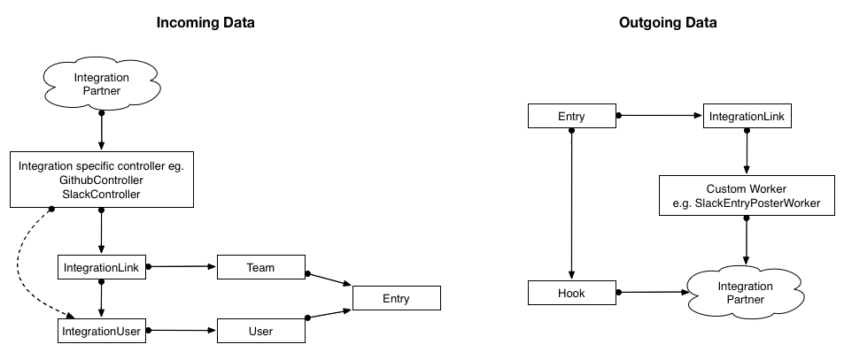

#Integration Infrastructure

A core "feature" of I Done This is that it (should) integrate with as many other applications as possible. Getting data into I Done This should be seamless no matter what else you are using.

In order to simplify the integration writing process, a common pattern and infrastructure has been set up that all integrations should try to follow as far as possible. Exceptions to this infrastructure may have to occurr for some specialized integration, but we have yet to come across any such integration.

The following diagram explains roughly the flow of data in an integration.



Establishing an `IntegrationUser`
---

The first step in the integration life cycle is to go to the `/integrations` page and click the "Add to I Done This" button. This should redirect us either into an OAuth authentication flow with the integration partner, or directly into the integration specific controller on our end responsible for creating the `IntegrationUser`.

After an `IntegrationUser` has been created, we can create an `IntegrationLink`.

Creating an `IntegrationLink`
---

After the user has clicked on "Add to I Done This" and gone through the authentication flow to link up their user with the integration partner, they should be given a form allows them to enter the specific details and configurations of the integration, such as which I Done This team the integration should be hooked up to, and in the case of the slack integration which channel entries should go into.

When they are done configuring the specific integration and submit the form, they should be directed to the settings page for their team or their user, depending on what type of integration it is.

The `IntegrationLink` should now be established and the user is done.

##Setting up a controller for the integration


The first step in creating a new integration is to create a controller for that integration. The purpose of this controller is to abstract away the specifics of the integration partner, so that we're just left to deal with simpler matters internally.

This controller should live under `app/controllers/integrations/` and be called `<integration_name>_controller.rb`.

The general structure (although it is not set in stone) is as follows, using the Slack integration as example.

```
  get    '/auth/slack/callback'     => 'integrations/slack#oauth_callback'
  get    '/integrations/slack/link' => 'integrations/slack#new_link'
  post   '/integrations/slack/link' => 'integrations/slack#create_link'
  delete '/integrations/slack/link' => 'integrations/slack#destroy_link'
  post   '/integrations/slack/hook' => 'integrations/slack#hook'
```
I'll explain the 5 different standard methods below.

### `oauth_callback`

If the integration partner uses OAuth to establish a link (which most do), we will be using [OmniAuth](https://github.com/intridea/omniauth) to do the authentication handling, and at the end of the auth handshake process we have to end up somewhere, which is where this method comes in.

This method is responsible for taking the OAuth result from OmniAuth and creating an `IntegrationUser`.

### `new_link`

The `new_link` method is called after the user has established an `IntegrationUser` and is responsible for displaying the form page where you can set up and configure new `IntegrationLink`s.

This is the page that is linked to from the `/integrations` page and as such will have to redirect to establish an `IntegrationUser` if an `IntegrationUser` doesn't already exist.

### `create_link`

From the `new_link` form page, we have a `POST` request to create a new link that is handled by the `create_link` method. This method is responsible for creating an `IntegrationLink`, which may or may not involve communicating with the integration partner to establish said link (e.g. for Github we register a webhook on the repo).

An integration link will show up in the UI either on the team settings page or the users settings page, depending on what type of integration it is (configured in the `IntegrationLink` model). At the end of the `create_link` method, you should redirect to the appropriate page where the `IntegrationLink` will show up.

### `destroy_link`

The `destroy_link` method will be called from the team settings page or the users settings page (where the `IntegrationLink` is displayed in the UI, along with a remove button). It's responsible for removing the `IntegrationLink` along with anything we did at the integration partners end (e.g. removing the webhook from a Github repo).

### `hook`

The hook method is responsible for collecting data from the integration partner. When new data arrives from the integration partner it should go to the `hook` endpoint, at which point we'll do whatever integration partner-specific data processing to pull out who this data comes from and how it translates into an entry.

See illustration above for "Incoming Data".

This involves finding the appropriate `IntegrationUser` and `IntegrationLink` so that we can link the data to both a `User` and a `Team`, which we need in order to create an `Entry`.

The `hook` method should return whatever the integration partner expects us to return to acknowledge the receipt of data. Usually just an empty `200` response.


##Does the integration need to send out data?

If the integration has outgoing data, that should be handled by an `after_create` filter on the appropriate model (usually the `Entry`). Which in turn should call an integration specific worker model, **don't** put all the integration specific code in the `Entry` model, just put in the `after_create` method that calls the worker.

##Customizing the `IntegrationLink` for UI purposes

The `IntegrationLink` is shown in either the team settings page or the user settings page. Which it shows up in is determined by `IntegrationLink.for_user` and `IntegrationLink.for_team` respectively. The `IntegrationLink` model has an `integration_type` attribute which should be set by the respective integration controllers, this is then used to filter the integration links by.

In the UI, the `IntegrationLink` displays its name and a summary of what it is/does.

The `IntegrationLink#short_name` and `IntegrationLink#summary` respectively are responsible for this.

In the UI there will be a button to delete the `IntegrationLink`, where the form for that button will `POST` depends on the `IntegrationLink#delete_path` method.

**When you add a new integration, make sure to add the new integration type to each of these methods.**
