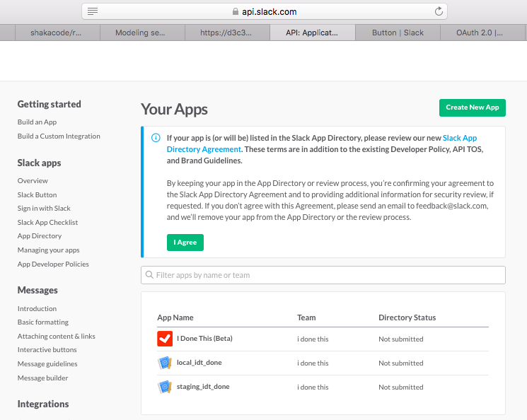
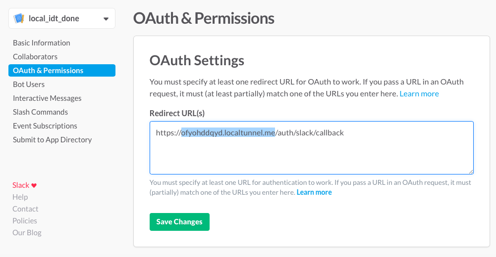
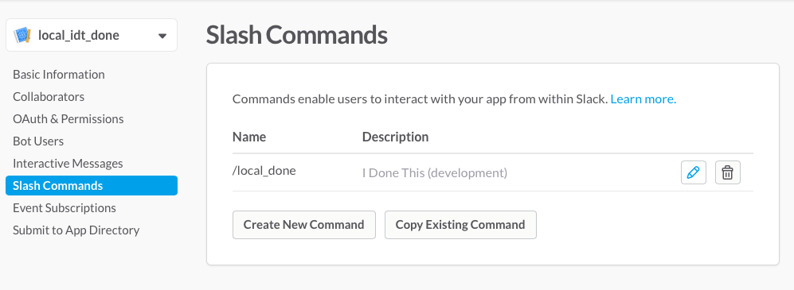
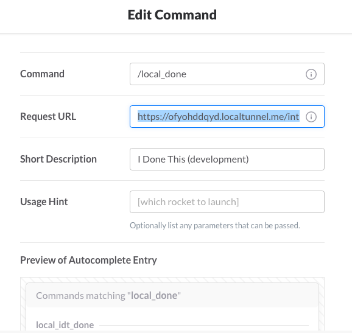
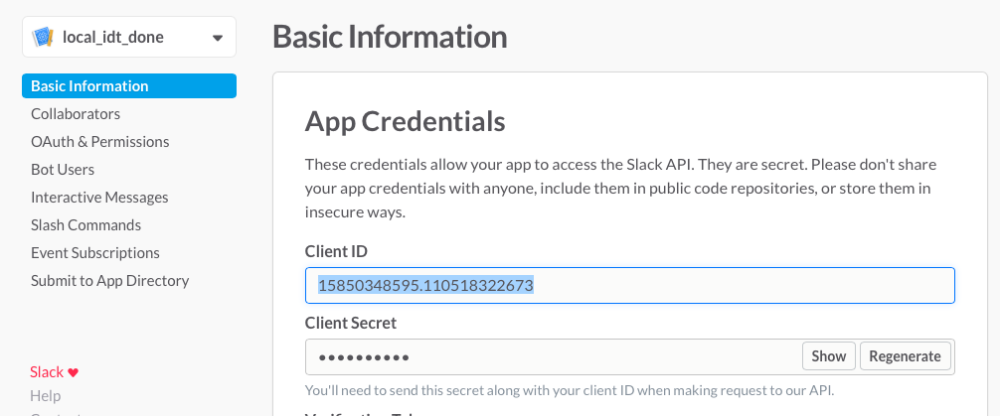
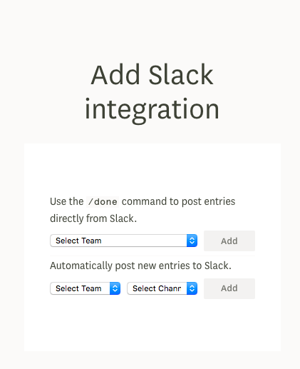

#Slack App Setup

##Local Slack App Setup

Prepare software
---

* Download some local tunnel software: `https://www.npmjs.com/package/localtunnel`
* Startup localtunnel to get url accessible from the Internet to local env: `https://&lt;localtunnel_domain&gt;/`
* Goto `https://api.slack.com/apps`, change to 'idonethis' team or add 'idonethis' team, look for 'local_idt_done' You should see something like:



Configure Slack platform
---

* Select 'local_idt_done'
* Click 'OAuth and Permissions' and change the 'Redirect URL(s)' to `https://&lt;localtunnel_domain&gt;/auth/slack/callback` and click 'Save'



* Click 'Slash Commands' and click on the 'Edit' (pencil icon) for `/local_idt_done` command:



* Change the 'Request URL' to `https://&lt;localtunnel_domain&gt;/integrations/slack/hook` and click 'Save'



Configure Rails env
---

* Change .env to the right SLACK_API_KEY and SLACK_API_SECRET, which you can get from 'Basic Information' Slack app page



* Change `config/environments/development.rb` to use the &lt;localtunnel_domain&gt; so that the entire flow use the same domain, and it's not mixed with access to localhost.

```
  # Settings specified here will take precedence over those in config/application.rb.
  routes.default_url_options = {
    host: <localtunnel_domain (without https)>,
    port: 443,
  }
```

Create integration
---

* Login as user that no slack channels yet (see `app/controllers/integrations/slack_controller.rb#new_link` and `#create_link` for logic whether you can see the integration options to 'post' to slack channel or 'receive' entries in channel
* Now head over to `https://&lt;localtunnel_domain&gt;/integrations/slack/link` and you should see:



